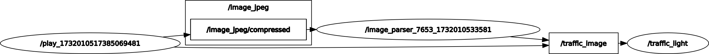
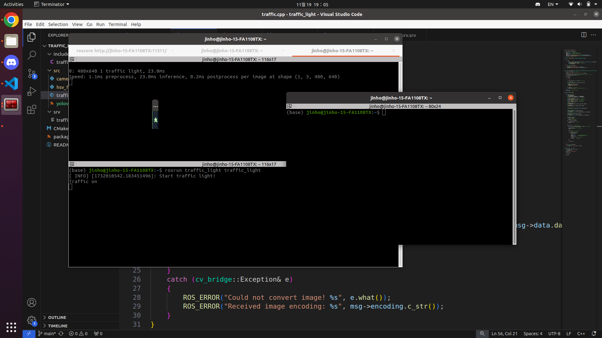
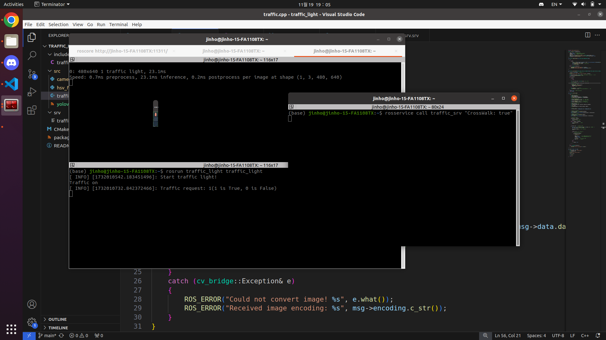
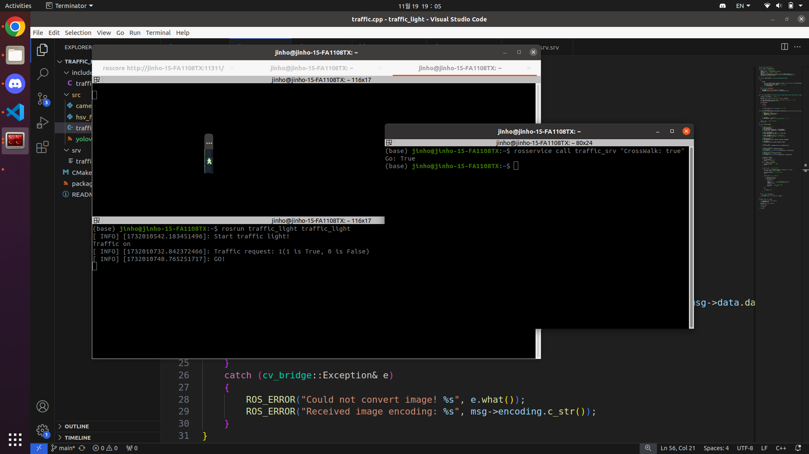

# Detect Traffic Light using HSV Filter

## Introduction

Detect traffic light, green or red.
([velog url](https://velog.io/@jinhoyoho/%EC%9E%90%EC%9C%A8%EC%A3%BC%ED%96%89-HSV%EB%A5%BC-%EC%9D%B4%EC%9A%A9%ED%95%9C-%EC%8B%A0%ED%98%B8%EB%93%B1-%EC%9D%B8%EC%A7%80))



rqt_graph using ros bag file.
1. Receive camera image.
2. Do preprocess image.
- camera -> yolo (I only detect 'traffic light' class. You can change it at 'camera.py')
3. Classify it which is red or green, using HSV Filter.
It doesn't work until a service request is received.
When the code receives a service request and watches a green light after watching a red light, the code sends a "GO" as a response.

## Installation

### Prerequisites (My version)

- Ubuntu = 20.04
- ROS1 Noetic
- Python = 3.10.14
- Pytorch = 1.12.0 (with CUDA)
- Ultralytics
- OpenCV

## Clone this repository

```Shell
git clone https://github.com/jinhoyoho/traffic_light.git
```

## Create a conda virtual environment and activate it (conda is optional)

```Shell
# Create conda virtual environment
conda create -n traffic_light python=3.10 -y
# Activate conda virtual environment
conda activate traffic_light

# Install Ultralytics
pip install ultralytics

# Install Pytorch and CUDA
pip install torch==1.12.0+cu116 torchvision==0.13.0+cu116 torchaudio==0.12.0 --extra-index-url https://download.pytorch.org/whl/cu116

```

## Running

```Shell
cd ~/catkin_ws/
catkin_make
```

```Shell
# Execute three execute files.
rosrun traffic_light camera.py
rosrun traffic_light traffic_light
```
or
```Shell
roslaunch traffic_light traffic_light.launch
```

## Result
Green Light before receiving service request.

Red Light after receiving service request.

Green Light after receiving service request.

